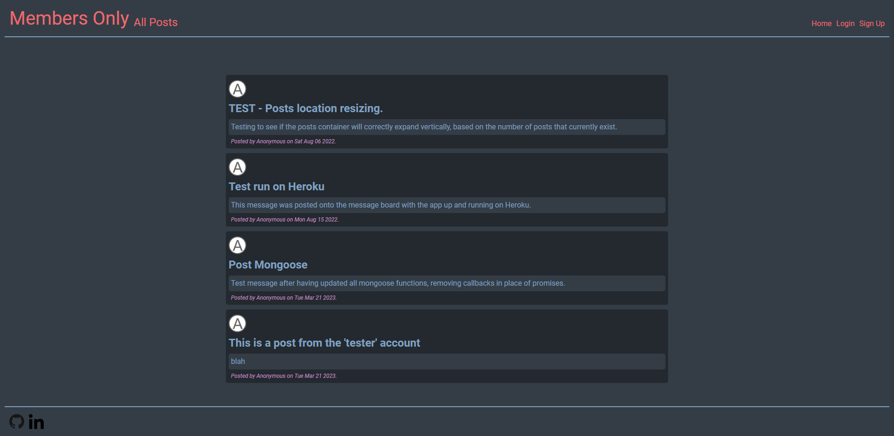

# Members Only

<!-- 
<a href="" target="_blank">See it live!</a>
 -->

## Table of Contents

- [Members Only](#members-only)
  - [Table of Contents](#table-of-contents)
  - [Project Information](#project-information)
  - [Features](#features)
  - [Packages, Frameworks, and Technology](#packages-frameworks-and-technology)

## Project Information

[Project details](https://www.theodinproject.com/lessons/nodejs-members-only)

Message board project focused around identity and access through tiered levels of authentication.

- CRUD app built around the MVC architectural design pattern.
- Two collections exist within MongoDB Atlas, Users and Messages.
- All information within database managed via api REST requests.

## Features

- Site access is divided into 3 levels: guest, member, admin.
- Guests can only see the body of the message posted.
- Guests can create an account to become a member.
- Members can post and delete their own messages, but the identity of other message owners remains hidden.
- Admins can post messages, delete anyone's message, and can view the identity of other message owners.
- User password and access level passwords for members and admins are all hashed before being stored in database.

## Packages, Frameworks, and Technology

- [Axios](https://axios-http.com/docs/intro)
- [BcryptJs](https://www.npmjs.com/package/bcryptjs)
- [CSS3](https://devdocs.io/css/)
- [Dotenv](https://www.npmjs.com/package/dotenv)
- [Ejs](https://ejs.co/)
- [Express](https://expressjs.com/)
- [Express Session](https://www.npmjs.com/package/express-session)
- [Express Validator](https://express-validator.github.io/docs)
- [Font Awesome](https://fontawesome.com/)
- [Google Cloud, App Engine](https://cloud.google.com/appengine)
- [HTML5](https://devdocs.io/html/)
- [Javascript](https://www.javascript.com/)
- [Mongoose](https://mongoosejs.com/)
- [MongoDB Atlas](https://www.mongodb.com/atlas/database)
- [NodeJs](https://nodejs.org/en/docs/)
- [NPM](https://docs.npmjs.com/)
- [Passport](https://www.passportjs.org/)
